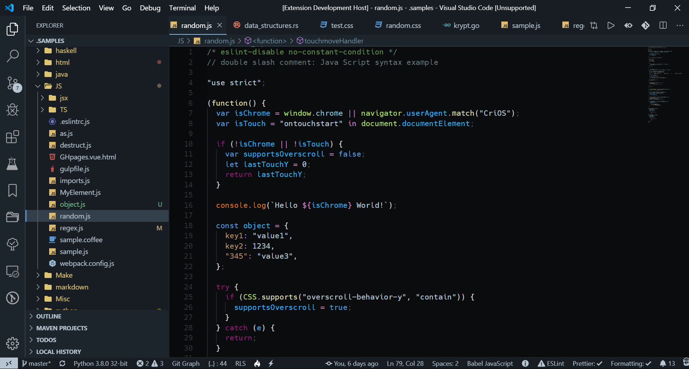

# ZIR NIHIL

## **Visual Studio Code** Theme (dark)

Inspired by [City Lights](http://citylights.xyz/)

Main Window:
>

Settings:
>

File tree:
>

CSS syntax:
>

## Related Settings

1. Icon theme: [Material Icon Theme](https://marketplace.visualstudio.com/items?itemName=PKief.material-icon-theme)

  > "material-icon-theme.folders.theme": "classic",  
  > "material-icon-theme.folders.color": "#fdd835",  
  > "material-icon-theme.saturation": 0.75,  
  > "material-icon-theme.opacity": 0.9,  

2. [Custom CSS](https://github.com/be5invis/vscode-custom-css) for scrollbars: 

  >	"vscode_custom_css.imports": ["./themes/css/overrides.css"],  
  >	"vscode_custom_css.policy": true,  

3. Alternate [indent lines](https://github.com/SirTori/indenticator)

  >"indenticator.inner.style": "solid",  
  >"indenticator.style": "solid",  
  >"indenticator.inner.showHighlight": true,  
  >"indenticator.color.dark": "rgb(1, 162, 226)",  
  >"indenticator.inner.color.dark": "#81A1C1",  

4. Font: [DejaVu Sans Mono - Bront](https://github.com/chrismwendt/bront)

  >  "editor.fontFamily": "'DejaVu Sans Mono - Bront', Input, Menlo, Monaco, Consolas, 'Courier New', monospace",  
