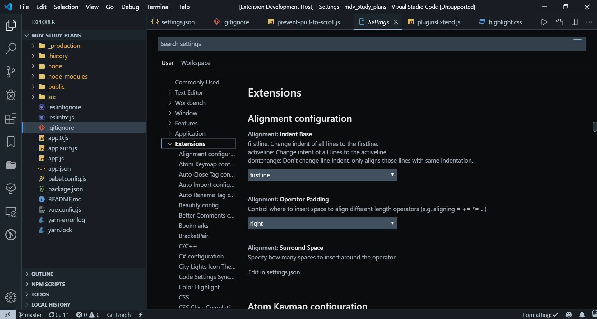
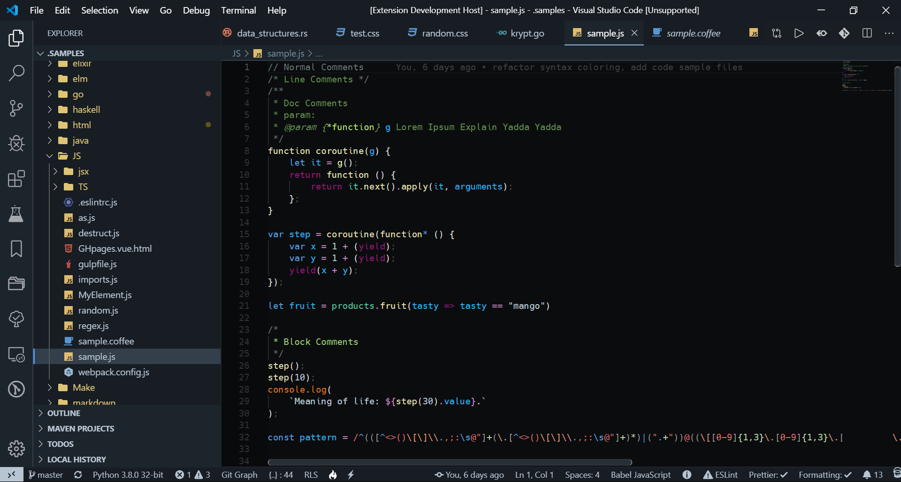
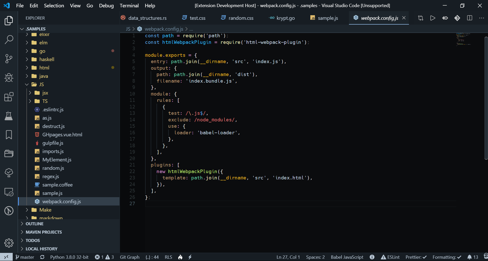
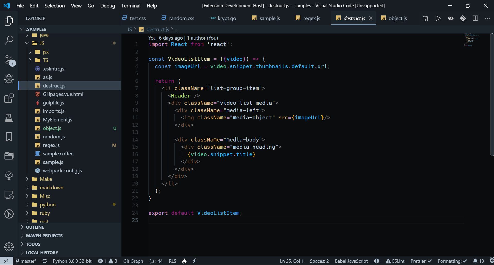
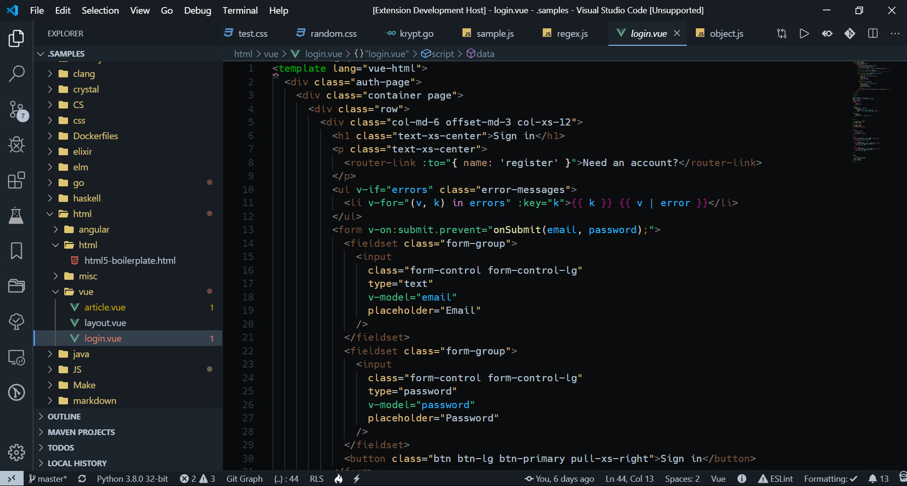
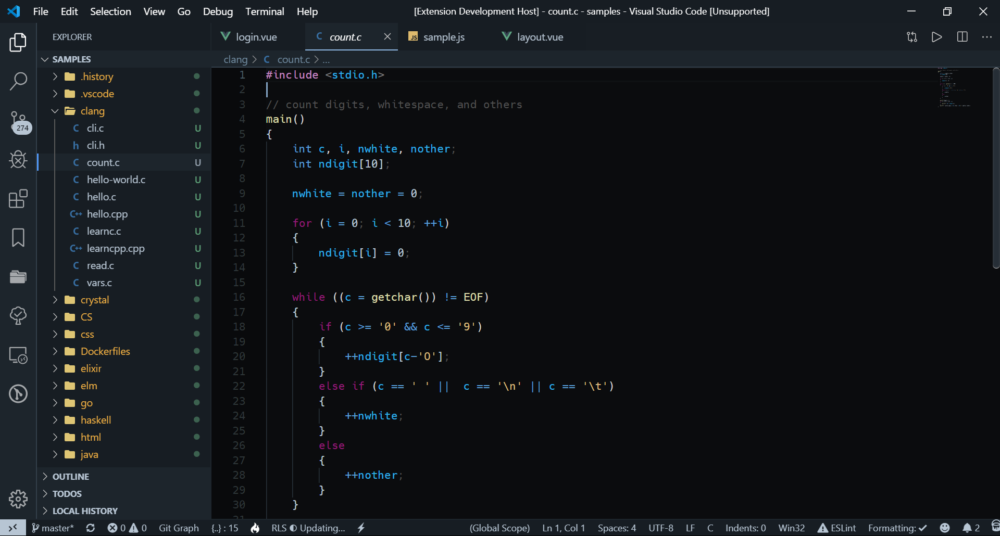
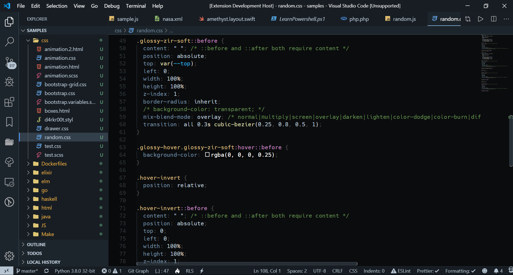
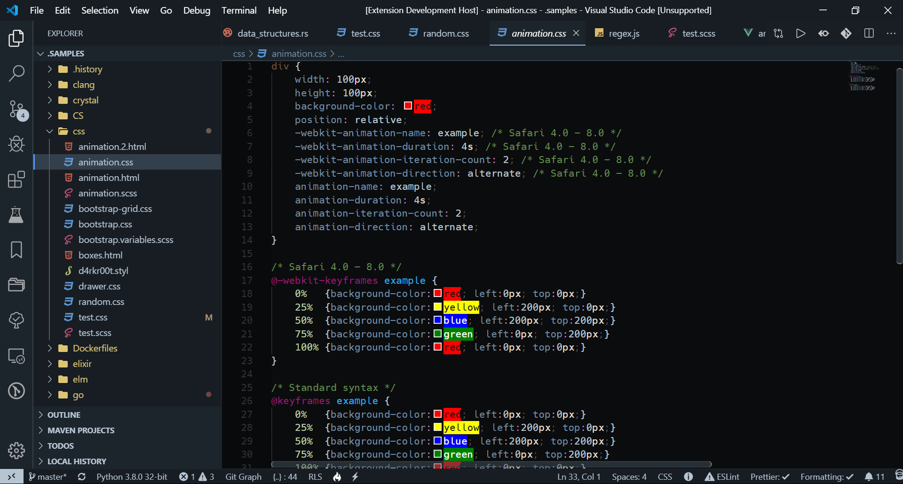
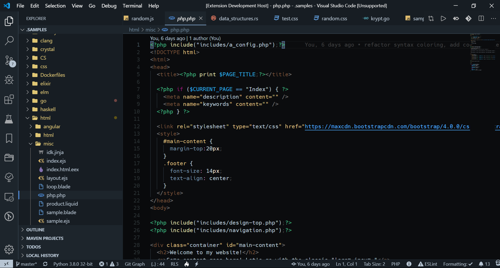

# ZIR NIHIL

## **Visual Studio Code** Theme (dark)

- Syntax adjusted to give more vivid and warmer colours.
- Colouring of folder/file tree pane simplified (using css inject extension).
- [Bracket Pair Colorizer](https://marketplace.visualstudio.com/items?itemName=CoenraadS.bracket-pair-colorizer) not recommended with this theme as it might be adding to much color sprinkle.

---

Main Window (Java Script syntax coloring):
>

VSC Settings:
>

Python:
>

Java Script:
>

Java Script (module):
>

Java Script Typescript:
>

Java Script (object):
>

Java Script React:
>

Java Script Vue (template):
>

Java Script Vue (script):
>

C:
>

C#:
>

CSS:
>

CSS (animation):
>

Go:
>

HTML:
>

Java:
>

PHP:
>

Ruby:
>

Rust:
>

Swift:
>

XML:
>
---
## Settings for some extensions used

1. Icon theme: [Material Icon Theme](https://marketplace.visualstudio.com/items?itemName=PKief.material-icon-theme)

  > "material-icon-theme.folders.theme": "classic",  
  > "material-icon-theme.folders.color": "#fdd835",  
  > "material-icon-theme.saturation": 0.75,  
  > "material-icon-theme.opacity": 0.9,  

2. [Custom CSS](https://github.com/be5invis/vscode-custom-css) for scrollbars:  
Download [overrides.css](https://github.com/zirdev/zir-vscode-nihil/blob/master/themes/css/overrides.css)
  >	"vscode_custom_css.imports": ["./themes/css/overrides.css"],  
  >	"vscode_custom_css.policy": true,  

3. Alternate [indent lines](https://github.com/SirTori/indenticator)

  >"indenticator.inner.style": "solid",  
  >"indenticator.style": "solid",  
  >"indenticator.inner.showHighlight": true,  
  >"indenticator.color.dark": "rgb(1, 162, 226)",  
  >"indenticator.inner.color.dark": "#81A1C1",  
4. [Error Lens](https://github.com/phindle/error-lens)

  >"errorLens.delay": 500,  
  >"errorLens.gutterIconsEnabled": true,  

5. Font: [DejaVu Sans Mono - Bront](https://github.com/chrismwendt/bront)

  >  "editor.fontFamily": "'DejaVu Sans Mono - Bront', Input, Menlo, Monaco, Consolas, 'Courier New', monospace",  
---
## Sources

- UI forked from from [City Lights](http://citylights.xyz/)
- syntax schema forked from [Dark Plus Syntax](https://github.com/dunstontc/dark-plus-syntax)
- code syntax samples forked from [Dark Plus Syntax](https://github.com/dunstontc/dark-plus-syntax)

---
## ToDo

- [ ] Python Syntax - missing class(?) decorator
- [ ] Rust Syntax - missing variable decorator
- [ ] improve bracket pair highlighting
- [ ] consider toning down folder tree CSS color
